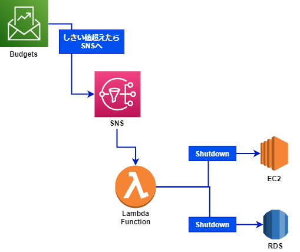

# aws-cost-saver

## 概要

予め決められた AWS 利用料金 (月額) に達すると起動している EC2 インスタンスと RDS インスタンス、Aurora クラスターをシャットダウンします。  
AWS 利用料金上限と三段階のしきい値を決定し CloudFormation テンプレートをデプロイすると以下のリソースが作成されます。  

  

## 注意点

起動している EC2/RDS を強制的にシャットダウンします。  

シャットダウン中でも各種ストレージや EIP など料金が発生するリソースもございます。  
それは手動で管理をお願いします。  

RDS はシャットダウン後、8日で自動的に起動します。  
料金を発生させたくない場合は手動で削除をお願いします。  

## 環境変数のセットアップ

環境変数をセットアップします。  

| 環境変数名          | 値                                                         |
| ------------------- | ---------------------------------------------------------- |
| MYS3BUCKETNAME      | lambda zip をアップロードする S3 バケット名                |
| MYS3BUCKETSTACKNAME | 上の S3 バケットを作成するための CloudFormation スタック名 |
| DEPLOYSTACKNAME     | 環境一式をデプロイするための CloudFormation スタック名     |
| Amount              | 月額利用料金の上限値、USD で指定                           |
| Actual1             | 第一段階のしきい値、上限値の n %                           |
| Actual2             | 第二段階のしきい値、上限値の n %                           |
| Actual3             | 第三段階のしきい値、上限値の n %                           |
| EmailAddress        | しきい値超過の際に通知を送るメールアドレス                 |

値を変更して以下のコマンドを実行します。  

```bash
cd cfn
export MYS3BUCKETNAME=<your bucket name>
export MYS3BUCKETSTACKNAME=<your stack name>
export DEPLOYSTACKNAME=<your stack name>
export Amount=100
export Actual1=50
export Actual2=75
export Actual3=100
export EmailAddress=<your email address>
```

## Create S3 Bucket lambda upload

ローカルで zip した lambda コードを格納する S3 バケットを作成します。  
環境変数をセットアップした同じターミナルで以下のコマンドを実行すると S3 バケットが作成されます。  

```bash
aws cloudformation deploy  \
  --stack-name ${MYS3BUCKETSTACKNAME} \ 
  --template-file lambda-bucket.yml \
  --parameter-overrides S3BucketName=${MYS3BUCKETNAME}
```

S3 バケットが作成されたことを確認して次の手順へ進みます。  

## CloudFormation Package

Lambda をパッケージ化します。  

```bash
aws cloudformation package \
    --template-file aws-cost-saver.yml \
    --s3-bucket ${MYS3BUCKETNAME} \
    --output-template-file packaged-template.yml
```

## CloudFormation Deploy

packaged-template.yml が正しく作成されていれば  
次のコマンドでデプロイします。  

```bash
aws cloudformation deploy \
  --template-file packaged-template.yml \
  --stack-name ${DEPLOYSTACKNAME} \
  --parameter-overrides Amount=${Amount} EmailAddress=${EmailAddress} Actual1=${Actual1} Actual2=${Actual2} Actual3=${Actual3} \
  --capabilities CAPABILITY_NAMED_IAM
```
